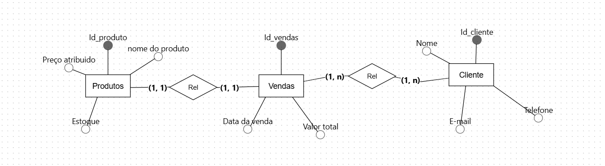
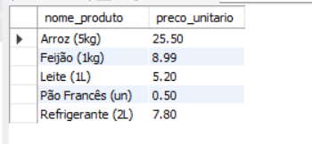
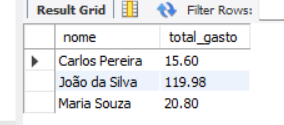
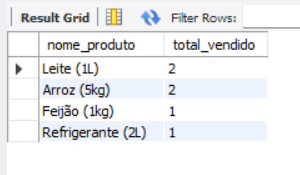

#   Projeto Banco de dados com MYSQL Workbench 

# TECNOLOGIAS UTILIZADAS:
### MYSQL Workbench;
### Brmodelo para conceito lógico;
### Git para commits;
### Github para o armazenamento do trabalho SQL.

# Imagens do projeto e suas explicações

Aqui está o modelo lógico, representando as tabelas presentes com sua cada chave, e com os atributos presentes representando o que cada um necessita.

produtos:
Chave primária: Id_produto;
Atributos: Preço atribuído, nome do produto e estoque.

Vendas:
Chave primária: Id Vendas;
Atributos: Data da venda e valor total.

cliente:
Chave primária: Id_cliente
Atributos: E-mail, telefone e nome

Essa consulta está extraindo os produtos do estoque e o valor de cada um.

Essa consulta está extraindo o nome de quem comprou e o total gasto no mercado.

Essa consulta feita está extraindo dados dos nomes dos produtos e o total vendido naquele dia.

# Problemas enfrentados: 

## Problemas comuns na hora de fazer os códigos mostrando erro, foquei em um único trabalho em vez de tentar entender esse e me compliquei.
